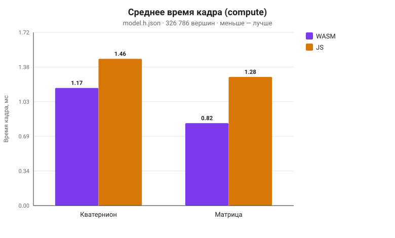
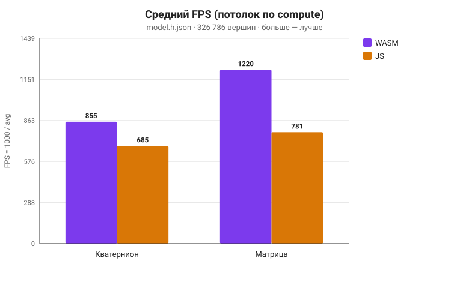
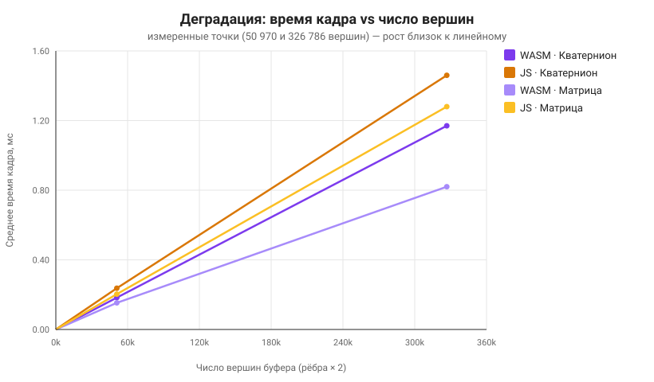
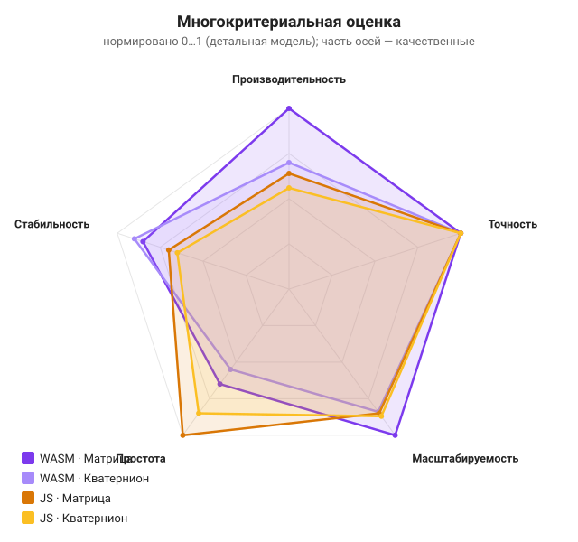

# Сравнительный анализ: WASM vs JavaScript

Данные двух бенчмарк-сессий от **23.06.2026**.
Окружение: **Firefox 149.0**, Ubuntu Linux x86_64. 300 кадров на сочетание,
прогрев 30 кадров. Измеряется время блока вычисления вращения (мс).

## 1. Сводная таблица

### `model.json` (50 970 вершин буфера)

| Метод вращения | Движок | Вершин | Ср. FPS | Min, ms | Max, ms | Avg, ms |
|----------------|--------|--------|---------|---------|---------|---------|
| Кватернион | WASM | 50 970 | 5454.5 | 0.000 | 2.000 | **0.183** |
| Кватернион | JS   | 50 970 | 4225.4 | 0.000 | 2.000 | **0.237** |
| Матрица    | WASM | 50 970 | 6521.7 | 0.000 | 1.000 | **0.153** |
| Матрица    | JS   | 50 970 | 4918.0 | 0.000 | 1.000 | **0.203** |

### `model.h.json` (326 786 вершин буфера)

| Метод вращения | Движок | Вершин | Ср. FPS | Min, ms | Max, ms | Avg, ms |
|----------------|--------|--------|---------|---------|---------|---------|
| Кватернион | WASM | 326 786 | 854.7  | 0.000 | 2.000 | **1.170** |
| Кватернион | JS   | 326 786 | 684.9  | 0.000 | 3.000 | **1.460** |
| Матрица    | WASM | 326 786 | 1219.5 | 0.000 | 2.000 | **0.820** |
| Матрица    | JS   | 326 786 | 781.3  | 0.000 | 3.000 | **1.280** |

## 2. Коэффициент ускорения WASM vs JS

| Модель вращения | model.json (×) | model.h.json (×) |
|-----------------|----------------|-------------------|
| Кватернион | **×1.29** | **×1.25** |
| Матрица    | **×1.33** | **×1.56** |

> Ускорение = `Avg(JS) / Avg(WASM)`. WASM **быстрее во всех** сочетаниях. Для
> матрицы преимущество растёт с числом вершин (×1.33 → ×1.56); для кватерниона —
> почти стабильно (×1.29 → ×1.25).

## 3. Проверка корректности (max \|WASM − JS\|)

| Модель вращения | model.json | model.h.json |
|-----------------|------------|--------------|
| Кватернион | 1.490·10⁻⁷ | 2.384·10⁻⁷ |
| Матрица    | 5.960·10⁻⁸ | 1.192·10⁻⁷ |

Расхождение — на уровне точности `f32` (≈ `10⁻⁷`). Движки дают **идентичный**
результат; сравнивается одна и та же математика (гипотеза H3 подтверждена).

## 4. Удельная стоимость и масштабируемость

Удельная стоимость (по детальной модели) и коэффициент масштабирования при росте
числа вершин в **6.41×** (50 970 → 326 786):

| Сочетание | нс / вершину | Рост времени (факт) | Близость к линейному |
|-----------|--------------|---------------------|----------------------|
| WASM · Кватернион | 3.58 | ×6.39 | почти идеально (6.41) |
| JS · Кватернион   | 4.47 | ×6.16 | линейно |
| WASM · Матрица    | 2.51 | ×5.36 | сублинейно (амортизация overhead) |
| JS · Матрица      | 3.92 | ×6.31 | линейно |

Рост времени практически совпадает с ростом числа вершин ⇒ сложность **линейна**
по N (гипотеза H4 подтверждена).

## 5. Диаграммы

| Диаграмма | Файл |
|-----------|------|
| Среднее время кадра (bar) | [frame-time-chart.svg](images/frame-time-chart.svg) |
| Средний FPS (bar) | [fps-chart.svg](images/fps-chart.svg) |
| Радар (5 критериев) | [radar-chart.svg](images/radar-chart.svg) |
| Деградация по вершинам | [degradation-chart.svg](images/degradation-chart.svg) |
| **Потенциал WASM** | [wasm-potential.svg](images/wasm-potential.svg) |

Анализ потенциала WASM на крупных сценах — в [wasm-potential.md](wasm-potential.md).

## 6. Выводы

| Гипотеза | Формулировка | Вердикт | Обоснование |
|----------|--------------|---------|-------------|
| **H1** | WASM быстрее JS, выигрыш растёт с N | ✅ / 🟡 уточнена | WASM быстрее везде (×1.25–1.56); рост с N — только для матрицы |
| **H2** | Матрица дешевле кватерниона | ✅ | Матрица дешевле во всех 4 случаях (на 12–30%) |
| **H3** | JS идентичен WASM (в пределах f32) | ✅ | `max |WASM−JS| ≈ 10⁻⁷` |
| **H4** | Время кадра линейно по N | ✅ | Рост ×6.4 при росте вершин ×6.41 |
| **H5** | Есть порог окупаемости WASM | ❌ не подтверждена | WASM выгоден уже при 50k вершин; порог ниже диапазона |

## 7. Рекомендации по применению

- **WASM оправдан**, когда геометрия тяжёлая (сотни тысяч — миллионы вершин),
  важен запас на 60/120 FPS, или целевые устройства слабее (мобильные, где JIT
  менее агрессивен) — выигрыш в удельной стоимости компаундится в **миллионы**
  дополнительных вершин в бюджете кадра (см. [wasm-potential.md](wasm-potential.md)).
- **Чистого JS достаточно**, когда сцены лёгкие (< 50k вершин) и важнее простота
  поставки без Rust-тулчейна: современный JIT Firefox держит разрыв в пределах
  ~25–35%.
- **Матрица** предпочтительна для простых одноосевых поворотов (дешевле на ~12–30%);
  **кватернион** — когда нужны композиция, интерполяция и отсутствие гимбал-лока.

> ⚠️ **Ограничение измерения.** Firefox по умолчанию округляет `performance.now()`
> до **1 мс** (`privacy.reduceTimerPrecision`), отсюда `Min = 0` и целочисленные
> `Max`. Средние по 300 кадрам остаются репрезентативными (дизеринг квантования),
> но абсолютная точность ограничена; относительные выводы устойчивы. Для более
> тонкого замера — увеличить нагрузку или отключить округление таймера.
