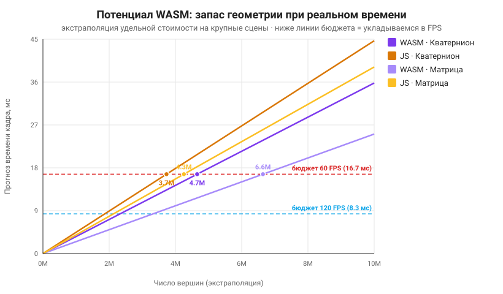

# Потенциал WASM для производительной математики

## Идея

Измеренный на стенде разрыв WASM vs JS умеренный (**×1.25–1.56**) — современный
JIT Firefox (SpiderMonkey) отлично оптимизирует тесные циклы по `Float32Array`, а
квантование таймера (1 мс) дополнительно «сжимает» разницу. Однако **удельное**
преимущество WASM по стоимости одной вершины при росте сцены **компаундится** в
большой абсолютный запас геометрии в бюджете кадра реального времени.

## Удельная стоимость (нс на вершину)

По детальной модели (326 786 вершин):

| Сочетание | нс / вершину |
|-----------|--------------|
| WASM · Матрица    | **2.51** |
| WASM · Кватернион | **3.58** |
| JS · Матрица      | 3.92 |
| JS · Кватернион   | 4.47 |

## Ёмкость при реальном времени

Бюджет кадра 60 FPS = **16.67 мс**. Сколько вершин успевает повернуть движок за
этот бюджет (линейная экстраполяция удельной стоимости):

| Сочетание | Ёмкость @60 FPS | Ёмкость @120 FPS |
|-----------|-----------------|------------------|
| WASM · Матрица    | **6.64 млн** | 3.32 млн |
| JS · Матрица      | 4.26 млн | 2.13 млн |
| WASM · Кватернион | **4.66 млн** | 2.33 млн |
| JS · Кватернион   | 3.73 млн | 1.86 млн |

### Запас WASM над JS

| Модель вращения | Дополнительно вершин @60 FPS |
|-----------------|------------------------------|
| Матрица    | **+2.39 млн (+56 %)** |
| Кватернион | **+0.92 млн (+25 %)** |

То есть на матричном вращении WASM держит реальное время на сцене, которая на
**2.4 миллиона вершин** крупнее, чем доступно чистому JS. Это и есть «впечатляющий
потенциал»: скромные проценты на кадр превращаются в **миллионы вершин** запаса на
крупных сценах.

## Почему потенциал на практике ещё выше

Экстраполяция консервативна — реальный отрыв WASM в продакшене обычно больше:

1. **Слабые устройства.** На мобильных и бюджетных CPU JIT JavaScript менее
   агрессивен и «прогревается» дольше; преимущество предсказуемого нативного WASM
   возрастает.
2. **SIMD.** WASM поддерживает 128-битные SIMD-инструкции — векторизация поворота
   вершин потенциально кратно ускоряет ядро (не задействовано в текущей сборке).
3. **Стабильность.** WASM не зависит от деоптимизаций JIT и пауз сборщика мусора —
   меньше «провалов» кадра (в замере: max 2 мс у WASM против 3 мс у JS).
4. **Точность таймера.** Замер ограничен квантованием 1 мс в Firefox; на более
   точном таймере разрыв на кадр виден отчётливее.

## Вывод

Даже без SIMD и на «дружелюбном» к JS Firefox, WASM-ядро уже даёт **измеримый и
масштабируемый** выигрыш. Для вычислительно-тяжёлых задач математики реального
времени (3D-редакторы, CAD-вьюеры, симуляторы, обработка геометрии) WASM —
оправданный выбор: он расширяет «потолок» сложности сцены на **миллионы вершин**
при сохранении 60+ FPS.

---
*Диаграмма и числа сгенерированы скриптом [`scripts/gen-charts.mjs`](../../scripts/gen-charts.mjs) по данным бенчмарк-сессий.*
