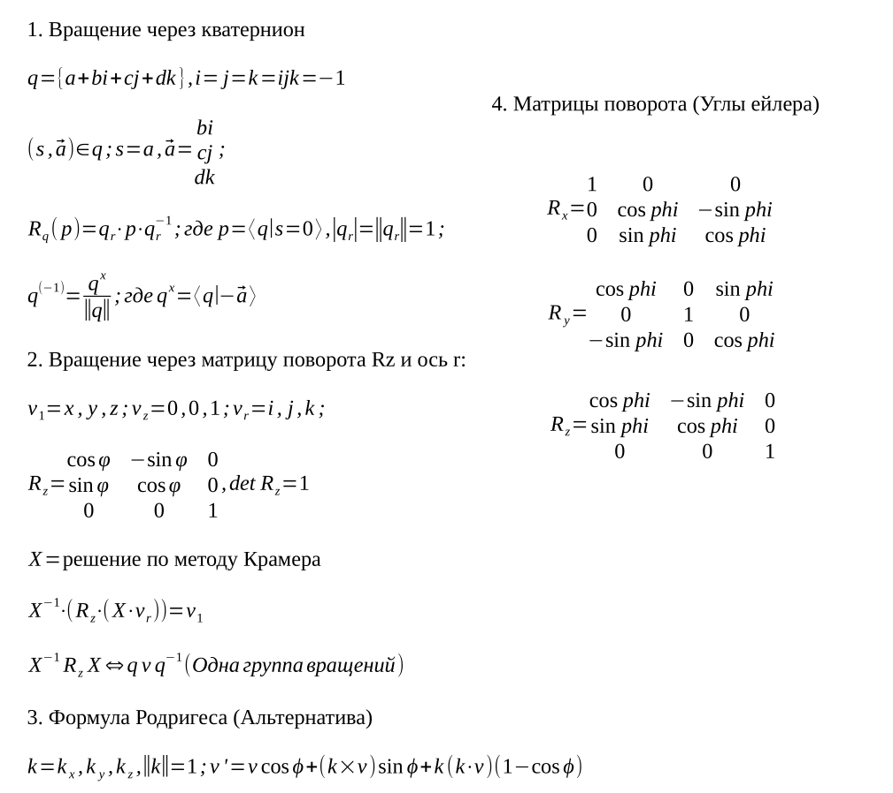
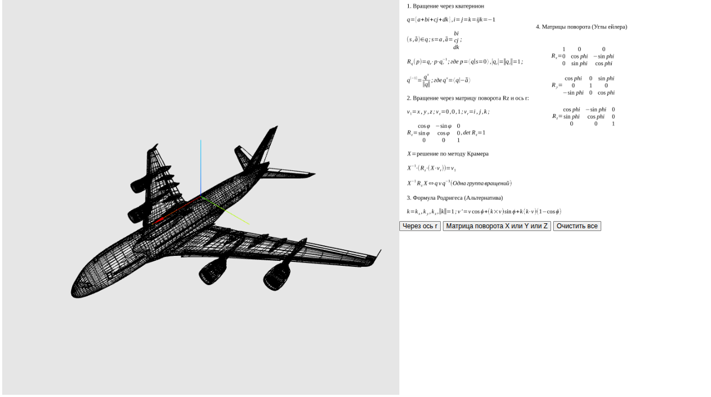
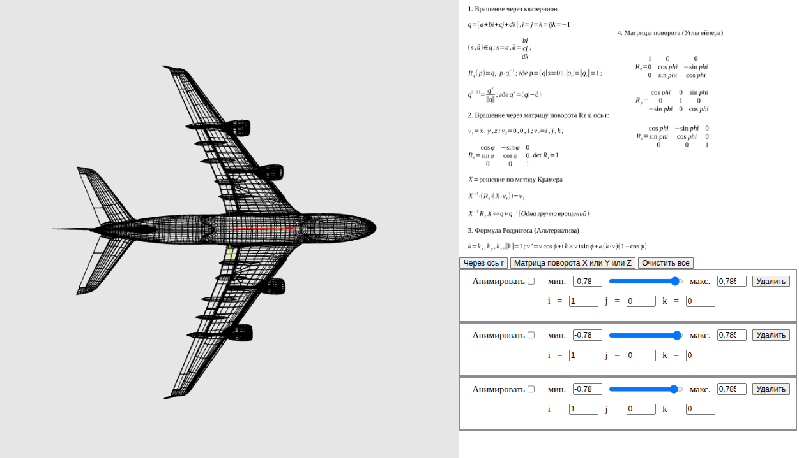

# 🌐 Quaternions & WebGL Frontend Demo

Демонстрационный проект, иллюстрирующий **выполнение ресурсоёмких математических вычислений на клиенте** с помощью Rust → WebAssembly, React и Three.js. 

Главная цель проекта: доказать, что сложные преобразования (вращения, матричная алгебра, работа с вершинами) можно эффективно выносить на фронтенд, снижая нагрузку на бэкенд и устраняя задержки сети при интерактивных 3D-сценах.

---

## ✨ Ключевые особенности

- 🔢 **Кватернионы vs Матрицы поворота**: наглядное сравнение двух подходов к 3D-вращению в реальном времени.
- ⚙️ **Rust → WASM**: вся математика и парсинг геометрии вынесены в нативный крейт, скомпилированный в WebAssembly.
- 🎨 **Three.js + WebGL**: рендеринг модели Boeing 747 через `THREE.Line` с оптимизированным обходом вершин.
- 🎛 **Desmos-подобный UI**: ползунки `min`/`max`, переключатель режима вращения, чекбокс анимации.
- 💾 **Оптимизация памяти**: использование мутабельных ссылок (`&mut`) в Rust для минимизации аллокаций и давления на GC в браузере.
- 📐 **Конвертация OBJ → JSON**: преобразование исходной модели для получения детерминированного порядка обхода точек.

---

## 🛠 Стек технологий

| Компонент       | Технологии                          |
|-----------------|-------------------------------------|
| Ядро вычислений | Rust, `wasm-pack`, WebAssembly      |
| Фронтенд        | React, Vite, JavaScript             |
| 3D-рендер       | Three.js, WebGL                     |
| UI-контролы     | Кастомные ползунки, чекбоксы        |
| Данные          | OBJ → JSON (препроцессинг вершин)   |

---

## Справка по расчетам



## 🖼 Демонстрация





> *Слева: вращение через кватернионы. Справа: через матрицы поворота. Управление параметрами в реальном времени.*

---

## 🏗 Архитектура и принципы работы

1. **Математическое ядро** (`rotation-core/`) реализовано на чистом Rust. Содержит модули:
   - `quat.rs` / `mat3.rs` / `vec3.rs` — реализация алгебры вращений.
   - `objp.rs` — парсинг и подготовка геометрии.
2. **Сборка WASM**: крейт компилируется в `.wasm`-модуль, который импортируется в JS-окружение без лишних оберток.
3. **Фронтенд** (React + Vite) управляет состоянием UI, передаёт параметры в WASM и синхронизирует результат с `THREE.Line` объектами.
4. **Оптимизация**: вместо создания новых объектов на каждый кадр используются мутабельные ссылки и прямая запись в буферы памяти WASM, что снижает overhead и обеспечивает стабильные 60 FPS даже при анимации тысяч точек.

---

## ⚙️ Установка и запуск

### Требования
- Node.js `v18+`
- Rust `v1.70+`
- `wasm-pack` (`cargo install wasm-pack`)

### Шаги
```bash
# 1. Установка JS-зависимостей
npm install

# 2. Сборка WASM-модуля
cd rotation-core
wasm-pack build --target web
cd ..

# 3. Запуск dev-сервера (React + Vite)
npm run dev