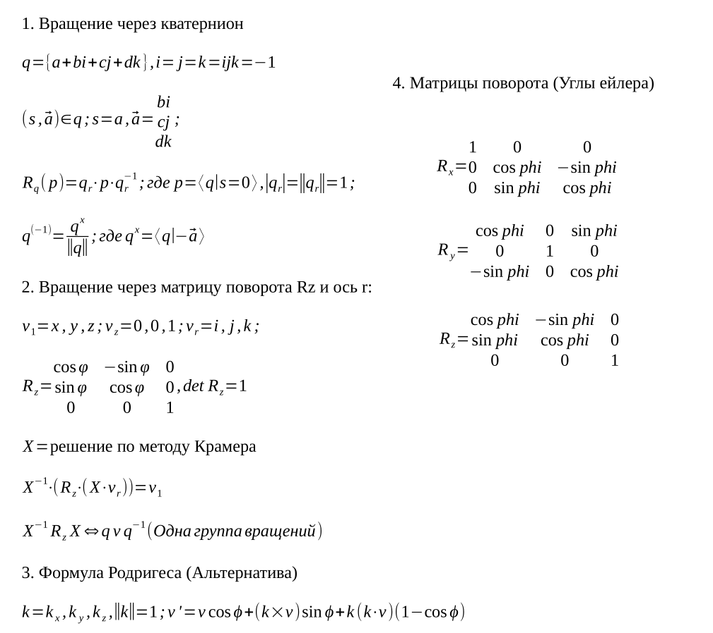
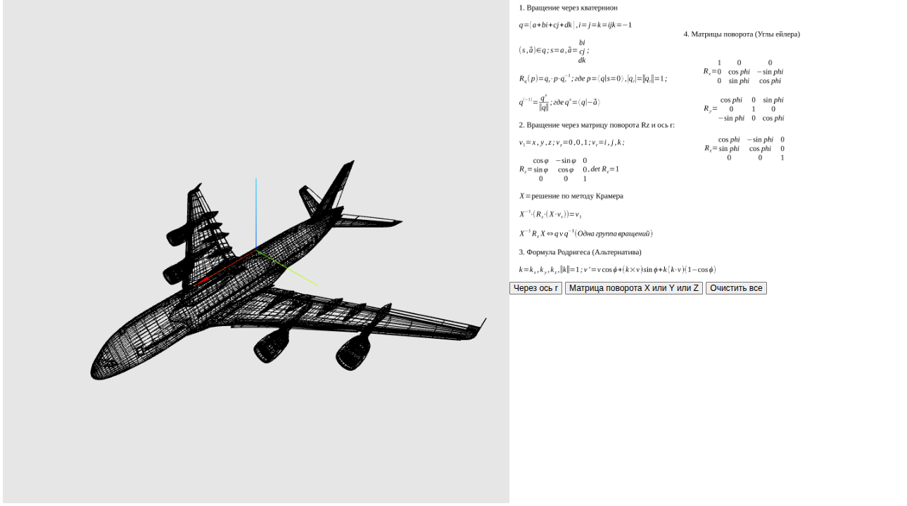
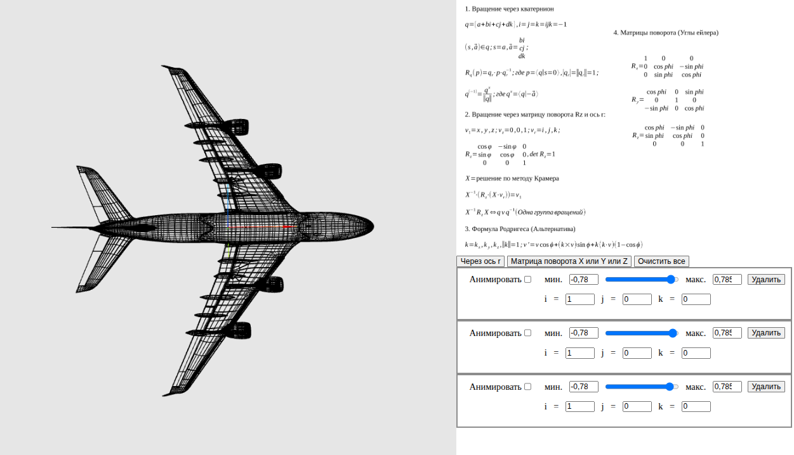

# 🌐 Quaternions & WebGL Frontend Demo

Демонстрационный проект, иллюстрирующий **выполнение ресурсоёмких математических вычислений на клиенте** с помощью Rust → WebAssembly, React и Three.js. 

Главная цель проекта: доказать, что сложные преобразования (вращения, матричная алгебра, работа с вершинами) можно эффективно выносить на фронтенд, снижая нагрузку на бэкенд и устраняя задержки сети при интерактивных 3D-сценах.

---

## ✨ Ключевые особенности

- 🔢 **Кватернионы vs Матрицы поворота**: наглядное сравнение двух подходов к 3D-вращению в реальном времени.
- ⚙️ **Rust → WASM**: вся математика и парсинг геометрии вынесены в нативный крейт, скомпилированный в WebAssembly.
- 🎨 **Three.js + WebGL**: рендеринг модели Boeing 747 через `THREE.Line` с оптимизированным обходом вершин.
- 🎛 **Desmos-подобный UI**: ползунки `min`/`max`, переключатель режима вращения, чекбокс анимации.
- 💾 **Оптимизация памяти**: использование мутабельных ссылок (`&mut`) в Rust для минимизации аллокаций и давления на GC в браузере.
- 📐 **Конвертация OBJ → JSON**: преобразование исходной модели для получения детерминированного порядка обхода точек.

---

## 🛠 Стек технологий

| Компонент       | Технологии                          |
|-----------------|-------------------------------------|
| Ядро вычислений | Rust, `wasm-pack`, WebAssembly      |
| Фронтенд        | React, Vite, JavaScript             |
| 3D-рендер       | Three.js, WebGL                     |
| UI-контролы     | Кастомные ползунки, чекбоксы        |
| Данные          | OBJ → JSON (препроцессинг вершин)   |

---

## Справка по расчетам



## 🖼 Демонстрация





> *Слева: вращение через кватернионы. Справа: через матрицы поворота. Управление параметрами в реальном времени.*

---

## 🏗 Архитектура и принципы работы

1. **Математическое ядро** (`rotation-core/`) реализовано на чистом Rust. Содержит модули:
   - `quat.rs` / `mat3.rs` / `vec3.rs` — реализация алгебры вращений.
   - `objp.rs` — парсинг и подготовка геометрии.
2. **Сборка WASM**: крейт компилируется в `.wasm`-модуль, который импортируется в JS-окружение без лишних оберток.
3. **Фронтенд** (React + Vite) управляет состоянием UI, передаёт параметры в WASM и синхронизирует результат с `THREE.Line` объектами.
4. **Оптимизация**: вместо создания новых объектов на каждый кадр используются мутабельные ссылки и прямая запись в буферы памяти WASM, что снижает overhead и обеспечивает стабильные 60 FPS даже при анимации тысяч точек.

---

## ⚙️ Установка и запуск

### Требования
- Node.js `v18+`
- Rust `v1.70+`
- `wasm-pack` (`cargo install wasm-pack`)

### Шаги
```bash
# 1. Установка JS-зависимостей
npm install

# 2. Сборка WASM-модуля
cd rotation-core
wasm-pack build --target web
cd ..

# 3. Запуск dev-сервера (Vite)
npm run dev
```

---

## 🔬 Режим исследования: WASM vs JavaScript

Помимо демонстрации, стенд работает как **исследовательский инструмент** (траектория «Исследование», СКФУ 2026). Реализованы:

- **Переключатель движка вычислений** — `WASM (Rust)` ↔ `чистый JavaScript`. JS-реализация (`src/math/rotations-js.js`) построчно идентична WASM-ядру; численно сверена: `max |WASM − JS| ≈ 3·10⁻⁵` (предел точности `f32`).
- **Оверлей метрик реального времени** — движок, FPS, время кадра (мс), число вершин.
- **Селектор модели** — `model.json` (≈ 51 тыс. верш. буфера) и `model.h.json` (≈ 327 тыс.) для оценки масштабируемости.
- **Бенчмарк-сессия** — кнопка «▶ Запустить бенчмарк» прогоняет 300 кадров для всех 4 сочетаний `{Кватернион, Матрица} × {WASM, JS}`, выводит таблицу (FPS, min/max/avg время кадра, коэффициент ускорения) и экспортирует текстовый отчёт.

---

## 📚 Документация

Полная документация проекта — в каталоге [`docs/`](docs/README.md):

| Раздел | Содержание |
|--------|-----------|
| [01 · Аналитика](docs/01-research-analysis/README.md) | постановка задачи, гипотеза, обзор области, аналоги, глоссарий |
| [02 · Требования](docs/02-requirements/README.md) | сценарии экспериментов, функциональные и нефункциональные требования |
| [03 · Архитектура](docs/03-architecture/README.md) | трёхслойная архитектура, поток данных, мат. модель |
| [04 · Реализация](docs/04-implementation/README.md) | Rust-ядро, JS-слой, WASM-мост, рендеринг |
| [05 · Бенчмарк ⭐](docs/05-benchmark/README.md) | методология и результаты измерений |
| [06 · Интерфейс](docs/06-ui/README.md) | скриншоты стенда |
| [07 · Завершение](docs/07-final/README.md) | выводы, руководства, тезисы |

---

## 📊 Статистика разработки

### Метрики Git
- **Всего коммитов:** 6
- **Период:** 2026-05-29 — 2026-06-22 (≈ 3,5 недели)
- **Средняя частота:** ≈ 1,7 коммита/неделю
- **Участники:** Seihposwag, wildcat2k21, Albert321

<!-- Опционально: скриншот активности из GitHub Insights -->
<!--  -->

---

## 🧪 Результаты исследования

### WASM vs JavaScript: производительность вычислений вращения

Среднее время кадра (compute) на детальной модели **`model.h.json`** (326 786 вершин), Firefox 149 / Ubuntu Linux, 23.06.2026:

| Метод вращения | WASM, мс | JS, мс | Ускорение | FPS (WASM/JS) |
|----------------|----------|--------|-----------|----------------|
| Кватернион | **1.170** | 1.460 | ×1.25 | 855 / 685 |
| Матрица    | **0.820** | 1.280 | ×1.56 | 1220 / 781 |

- **WASM быстрее JS** во всех режимах (×1.25–1.56); матрица дешевле кватерниона на 12–30 %.
- Результаты движков **идентичны**: `max |WASM − JS| ≈ 10⁻⁷` (предел точности `f32`).
- Сложность **линейна** по числу вершин (рост времени ×6.4 при росте вершин ×6.41).
- **Потенциал WASM:** в бюджете 60 FPS держит сцену на **+2.4 млн вершин** крупнее, чем JS.


Полный анализ, диаграммы и выводы: [docs/05-benchmark/comparison.md](docs/05-benchmark/comparison.md) · [docs/05-benchmark/wasm-potential.md](docs/05-benchmark/wasm-potential.md).